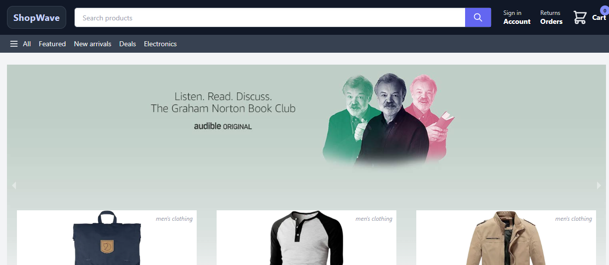

# ShopWave

A modern e-commerce storefront inspired by an online marketplace, built with Next.js, React, Redux Toolkit, NextAuth, and Stripe.

This project includes a home page with product listings, a shopping cart, Google sign-in, checkout flow, and order tracking UI.

## Features

- Product catalog and banner carousel
- Basket/cart management with Redux Toolkit
- Google authentication with NextAuth
- Stripe checkout session integration
- Order viewing page
- Responsive e-commerce layout
- Clean storefront design with a custom brand identity

## Tech Stack

- Next.js
- React
- Redux Toolkit
- Tailwind CSS
- Firebase (for order data integration)
- NextAuth
- Stripe

## Project Structure

- `src/pages` – app pages such as Home, Checkout, Orders, and Success
- `src/components` – reusable UI components like Header, Product, Banner, and Cart item cards
- `src/slices` – Redux state slices
- `src/app/store.js` – Redux store setup
- `src/styles/globals.css` – project styling
- `src/pages/api` – backend API routes for auth, Stripe checkout, and webhooks

## Screenshots

### Home page



### Product listing and deals


### Cart / checkout


### Orders page


### Success page


> Add your actual screenshots into the `docs/screenshots` folder and keep the same file names for the images above to render correctly.

## How it works

### 1. Browse products
Users land on the home page and see products from a public API feed with promotional banners and product cards.

### 2. Add items to cart
Products are added to the basket via Redux state, and the cart count updates in the header.

### 3. Sign in with Google
Users authenticate through Google using NextAuth.

### 4. Checkout
The checkout page displays the selected products and initiates a payment session through Stripe.

### 5. Orders view
Authenticated users can see their order details and associated images from Firebase-backed order records.

## Installation

### Install dependencies

```bash
npm install
```

### Run locally

```bash
npm run dev
```

The app will run on the local development server, typically at:

```text
http://localhost:3000
```

## Environment Variables

Create a `.env` file in the project root and add the required values:

```env
GOOGLE_ID=your_google_client_id
GOOGLE_SECRET=your_google_client_secret
NEXTAUTH_SECRET=your_secure_random_secret
NEXTAUTH_URL=http://localhost:3001

STRIPE_PUBLIC_KEY=your_stripe_public_key
STRIPE_SECRET_KEY=your_stripe_secret_key
STRIPE_SIGNING_SECRET=your_stripe_webhook_secret
HOST=http://localhost:3001

# Optional compatibility aliases used by this app
stripe_public_key=your_stripe_public_key
NEXT_PUBLIC_STRIPE_PUBLIC_KEY=your_stripe_public_key
```

## Production Notes

For production deployment on Vercel, update the URLs to your deployed domain and set the same environment variables in the Vercel project settings.

## Deployment

This project is ready to deploy on Vercel. Make sure to configure:

- Google OAuth redirect URL
- Stripe webhook URL
- production environment variables
- Vercel domain in `NEXTAUTH_URL` and `HOST`

## License

This project is for learning and portfolio/demo purposes.

## Future Improvements

- product search and filters
- better product detail pages
- improved checkout funnel
- order status tracking
- admin dashboard
- dark mode

---

If you want, I can also create a `docs/screenshots` folder and add placeholder image files or help you generate the actual page screenshots for this README.